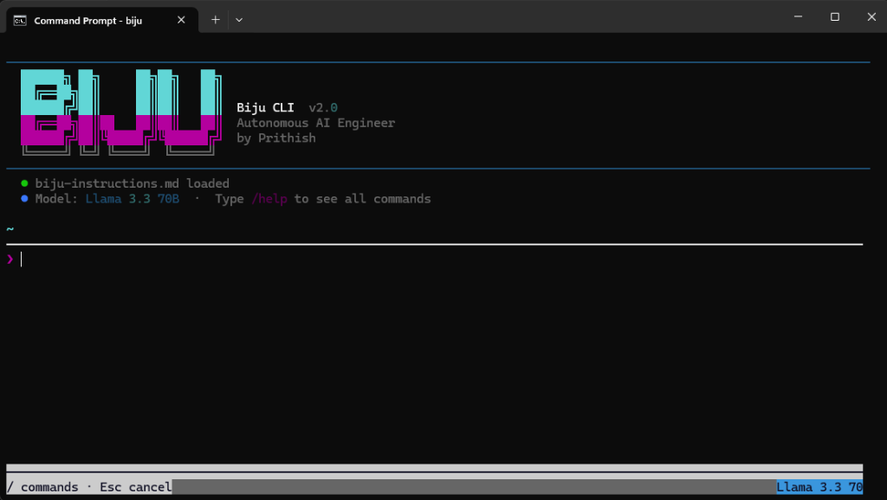
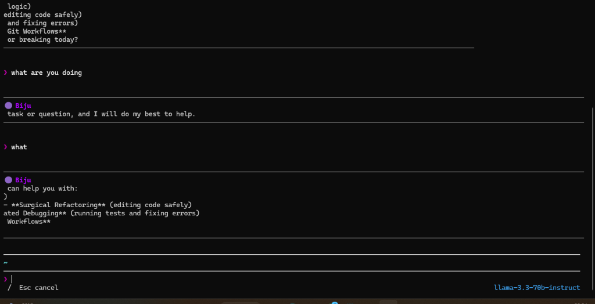
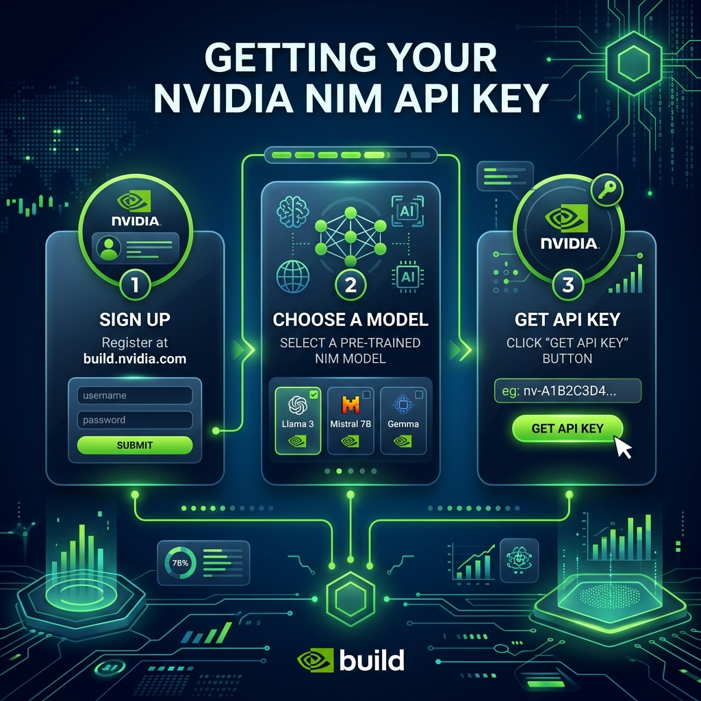

# 🤖 Biju CLI (v2.0)
> **An Autonomous AI Software Engineer in Your Terminal**

Developed by **[Prithish Raj T](https://github.com/Prithish-22)** 🚀

[](https://www.npmjs.com/package/biju-cli)
[](https://github.com/Prithish-22/open-source-cli/blob/main/LICENSE)

🚀 **Install globally in 5 seconds:**
```bash
npm install -g biju-cli
```

---

### 📷 Preview

| Biju CLI Console | Interactive Model Selector |
| :---: | :---: |
|  |  |

---

### 🎯 Why Biju CLI? (Our Purpose)
Most AI CLIs are frustrating—they force you into paid subscriptions, place strict limits, or try to bypass your own API integrations. 

**Biju CLI was created to change that!** It is **100% free and fully open-source**, built so you can plug in **your own API keys** and start building immediately.

> [!IMPORTANT]
> **We do not charge a single rupee or dollar!** Biju CLI itself is 100% free and open-source. When we mention "paid API", it simply means that those external third-party providers (like DeepSeek or Moonshot) may charge for usage on their own platforms when you generate their API keys. Biju CLI does not charge you anything!

* **NVIDIA NIM API:** Fully supported (Free and Paid tiers).
* **DeepSeek API:** Supported (Paid/External keys).
* **Moonshot (Kimi) API:** Supported (Paid/External keys).

### 🛠️ Active Daily Development
Biju CLI is under **active daily development**. New features, model updates, background capabilities, and bug fixes are being added continuously to give you the most state-of-the-art terminal AI engineering assistant possible!

---

Biju CLI is a premium, state-of-the-art Command Line Interface that transforms your terminal into an interactive AI workspace. Powered by high-performance AI APIs and featuring dedicated background-running AI agents, Biju CLI handles web research, code generation, testing, and git operations autonomously while you work.

---

## ✨ Features

* **🤖 Real Background Agents:** Spawn specialized, autonomous agents that run in the background. They have access to local file tools, web search, shell execution, and test suites.
  * 🔎 **Researcher:** Gathers web findings, summarizes topics, and provides direct sources.
  * 💻 **Coder:** Surgical code editor that writes and refines logic.
  * 🌿 **Git Agent:** Manages commits, reviews diffs, and pushes cleanly.
  * 📁 **File Agent:** Batch moves, renames, and manages directories.
  * 🧪 **Test Runner:** Runs your test suites, reads stack traces, fixes bugs, and loops until everything is green.
  * ⚡ **Shell Agent:** Autonomous shell execution and task runner.
* **🧠 Smart Task-Specific Models:** Biju automatically assigns the best-fitting, free NVIDIA-hosted models (e.g., *Dracarys 70B*, *Mistral Large 3*, *Llama 3.3 70B*) to each background agent, keeping you free of token limits and rate issues.
* **🏷️ Dynamic Model Selector:** Interactive `/model` command featuring human-readable descriptions of model strengths and purpose badges.
* **🎨 Premium Interactive UI:** Built using `rich` and `prompt_toolkit` to offer live token streaming, modern syntax highlighting, a beautiful status toolbar showing active background agents, and custom colors.

---

## 🔑 How to Get a Free NVIDIA NIM API Key (Step-by-Step)

Biju CLI utilizes the high-speed **NVIDIA NIM API** which provides access to state-of-the-art models (like Llama 3.3, Mistral Large, Qwen Coder, etc.) completely free of charge! Follow these steps to get your key in 2 minutes:

1. **Visit the NVIDIA Build Portal:**  
   Go to [NVIDIA Build](https://build.nvidia.com/).
2. **Sign Up/Log In:**  
   Click on the login icon in the top-right. Sign in with your existing NVIDIA account, or create a new one (it's entirely free and takes 1 minute).
3. **Select a Model:**  
   Click on any model (for example, `Llama 3.3 70B Instruct` or `Mistral Large 3`).
4. **Generate Your API Key:**  
   Under the selected model's interface, look for the **"Get API Key"** button. Click it, then click **"Generate Key"**.
5. **Copy Your Key:**  
   Copy the generated API key (it starts with `nvapi-`). Store it safely!

*Note: New accounts receive 1,000 free credits, which is more than enough for thousands of code generations and agent executions!*



---

## 🚀 Installation & Setup

### 1. Install Biju CLI Globally

You can install Biju CLI globally using either **NPM** (recommended) or **Pip**.

#### Option A: Install via NPM (Recommended)
You can install Biju CLI globally with a single command via npm:
```bash
npm install -g biju-cli
```

#### Option B: Install via Pip (Python)
If you prefer standard Python package installation:
```bash
pip install biju-cli
```

#### Direct Local Installation (for development/use)
1. Clone this repository or navigate to your downloaded project directory.
2. Install it locally:
   * Using NPM: `npm link`
   * Using Pip: `pip install -e .`
3. Launch the CLI from anywhere in your terminal:
   ```bash
   biju
   ```

### 2. Configure Your API Key (One-time Setup)
Once the CLI starts, you can set your key directly inside the interactive console. It will be stored securely on your local machine so you don't have to enter it again!

1. Open your terminal and run:
   ```bash
   biju
   ```
2. In the interactive console, type `/setkey` followed by your key:
   ```text
   ❯ /setkey nvapi-YOUR_COPIED_NVIDIA_KEY_HERE
   ```
3. Press **Enter**. You are all set! Biju CLI is ready to work.

---

## 🛠️ Usage & Commands

Launch the interactive console by typing `biju`. Inside the console, you can use the following commands:

| Command | Description |
| :--- | :--- |
| `/setkey <key>` | Save your NVIDIA NIM API Key securely |
| `/model` | Open the interactive model selector |
| `/agent <task>` | Spawn a dedicated, autonomous background agent to perform a task |
| `/agent status` | Check the current status of all running background agents |
| `/agent stop` | Safely terminate all active background agents |
| `/exit` or `/quit` | Exit the Biju console |

### 💡 Example Agent Commands
* `❯ /agent write a comprehensive python unit test for setup.py`
* `❯ /agent search the web and summarize the latest updates in Python 3.12`
* `❯ /agent clean up duplicate methods in main.py`

---

## 📦 How to Publish Biju CLI

You can publish Biju CLI to **NPM** and/or **PyPI** so anyone can install it!

### Option A: Publish to NPM (Recommended for easy installs)
1. **Register a free account** on [NPM](https://www.npmjs.com/).
2. Open your terminal in the root folder of Biju CLI and log in:
   ```bash
   npm login
   ```
3. Publish your package globally to the NPM registry:
   ```bash
   npm publish --access public
   ```
   *That's it! Anyone in the world can now run `npm install -g biju-cli`.*

---

### Option B: Publish to PyPI (Python Package Index)
To make your package installable via `pip install biju-cli`:

1. **Install Python Build Tools:**
   ```bash
   pip install --upgrade setuptools wheel twine
   ```
2. **Build Your Package:**
   ```bash
   python setup.py sdist bdist_wheel
   ```
3. **Upload to PyPI:**
   * Create a developer account on [PyPI](https://pypi.org/).
   * Generate an **API Token** from your Account Settings page.
   * Upload using twine:
     ```bash
     python -m twine upload dist/*
     ```
     *(Use `__token__` as the username, and paste your PyPI API token as the password).*

---

## 📄 License
This project is licensed under the MIT License.
